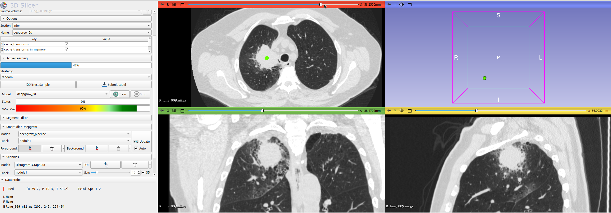
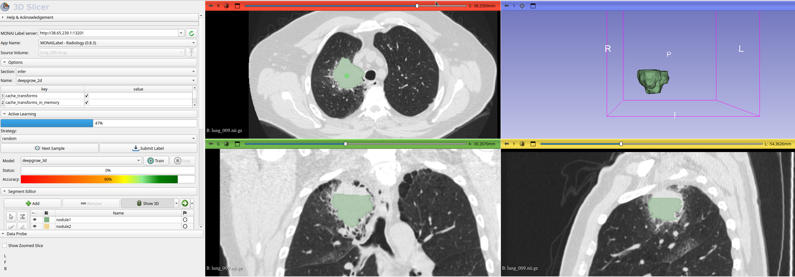
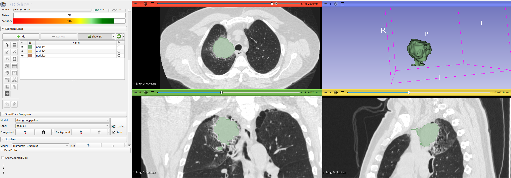
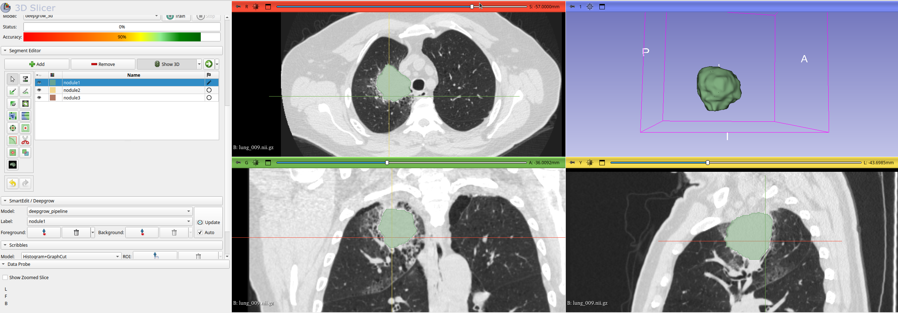

# Image Segmentation with MONAI Label and 3D Slicer

## Table of Contents
- [Setting Up MONAI Label on RunPod](#setting-up-monai-label-on-runpod)
  - [Background](#background)
  - [Deploying a RunPod](#deploying-a-runpod)
  - [Initializing MONAI Label Server](#initializing-monai-label-server)
  - [Accessing the MONAI Label API](#accessing-the-monai-label-api)
  - [Installing MONAI Label Plugin for 3D Slicer](#installing-monai-label-plugin-for-3d-slicer)
  - [Re-deploying a RunPod](#re-deploying-a-runpod)
- [Labeling Strategies](#labeling-strategies)
  - [Manual Labelling in 3D Slicer](#manual-labelling-in-3d-slicer)
  - [Labelling with MONAI Label](#labelling-with-monai-label)
- [Quality Control with MONAI Review](#quality-control-with-monai-review)
  - [For Labelers](#for-labelers)
  - [For Reviewers](#for-reviewers)
- [Examples](#examples)
  - [Lung Nodule Segmentation](#lung-nodule-segmentation)
- [Appendix](#appendix)
  - [MONAI Label Server Configuration Options](#monai-label-server-configuration-options)
  - [Saving MONAI Label Models](#saving-monai-label-models)
  - [Troubleshooting](#troubleshooting)
  - [Other Resources](#other-resources)

## Setting Up MONAI Label on RunPod

### Background
- MONAI Label is a software tool that uses machine learning to automate the image segmentation process. It is run on a server, and the user interacts with the server using a client.
- 3D Slicer is a client that is run on the user's local machine and allows for visualization and segmentation of imaging data.
- RunPod is a service that allows you to build a temporary server called a pod with a high end gpu for performing machine learning computations.
- Orthanc is software that is used to create a dicom server that stores data for imaging studies.
- MONAI Label will communicate with an Orthanc dicom server to pull studies and push segmentation files. This tutorial describes how to build a MONAI Label server on a RunPod.

### Deploying a RunPod
1. **Create a RunPod account**: Sign up and log in to RunPod. You will need to request access to the UT Academic AI Team account and will receive a URL to link this to your account.

2. **Configure the Pod**: 
   - Click Pods in the toolbar and then + Deploy. 
   - Select the cloud type Secure Cloud and change to Community Cloud. 
   - Select the location Any and change to US - United States. 
   - Change the internet speed from Med to High or Extreme. 
   - Check the box for Public IP. 
   - Select a GPU with at least 12GB VRAM, such as the RTX 4090. 
   - Remember to stop the machine when not in use to avoid hourly charges.

3. **Edit Template**:
   - Set an appropriate size for the temporary Container Disk and the persistent Volume Disk. 
   - Expose port 8000 under Expose TCP Ports. 

4. **Deploy the Pod**: Click Deploy On-Demand to start the pod.

5. **Connect to the Pod**: 
   - Click the down arrow to expand your RunPod. 
   - Click the Connect button, then Start Web Terminal, and Connect to Web Terminal. 
   - Alternatively, use the SSH link provided by RunPod to access through a terminal on your local computer.

### Initializing MONAI Label Server
1. **Set Up Environment**: Run the following in the RunPod terminal to create a virtual environment and install MONAI Label. This will also create a script deepgrow.sh that can be used to start a MONAI Label server with the DeepGrow model loaded that will pull studies from a dicom server. A more complete description of the start_server command as well as different options available for configuring a MONAI Label server are included in the Appendix.

    ```bash
    # Create and activate python virtual environment in permanent workspace directory
    cd /workspace &&
    python -m venv venv &&
    source /workspace/venv/bin/activate &&

    # Install monailabel and radiology app inside environment
    cd /workspace/venv &&
    pip install monailabel &&
    monailabel apps --name radiology --download --output . &&
    monailabel apps --name monaibundle --download --output . &&

    # Create script deepgrow.sh
    cd /workspace &&
    echo -e 'source /workspace/venv/bin/activate\nmonailabel start_server --app /workspace/venv/radiology --studies http://20.55.49.33/dicom-web --conf models "deepgrow_2d,deepgrow_3d"' > deepgrow.sh
    ```

2. **Edit the Default Labels**: Use the following command to change the default labels to nodule1, nodule2, nodule3. Note that each label is given a value of 1 because they are all the same class (nodules). You can specifiy different classes by assigning them any set of integer values.

    ```
    # Define the new labels
    NEW_LABELS='        self.labels = [\n            "nodule1",\n            "nodule2",\n            "nodule3"\n        ]'

    # Update the first config file
    CONFIG_FILE="/workspace/venv/radiology/lib/configs/deepgrow_3d.py"
    sed -i "/self.labels = \[/,/]/c\\$NEW_LABELS" "$CONFIG_FILE"

    # Update the second config file
    CONFIG_FILE="/workspace/venv/radiology/lib/configs/deepgrow_2d.py"
    sed -i "/self.labels = \[/,/]/c\\$NEW_LABELS" "$CONFIG_FILE"
    ```

3. **Run the Server**: Use the following command to start the MONAI Label server. 

    ```bash
    bash /workspace/deepgrow.sh
    ```

4. **Verify Server Status**: When the server is running, you should see the following text at the bottom of the terminal.

   `Uvicorn running on http://0.0.0.0:8000 (Press CTRL+C to quit)`

### Accessing the MONAI Label API
- **Find the API URL**: Click the RunPod Connect button and then TCP Port Mappings to get the URL. Use `http://` + `Public IP` + `:` + `External port`. For example, `http://69.145.85.93:30135`. Searching this in a browser while the server is running will bring up the API page. This is the url that will be input into 3D Slicer.

### Installing MONAI Label Plugin for 3D Slicer
1. **Install 3D Slicer**: Download and run 3D Slicer on your local machine.

2. **Install MONAI Label Plugin**: Navigate to the Extensions Manager in 3D Slicer and install MONAILabel.

3. **Add MONAI Label Plugin to Favorites**: From the Edit tab in 3D Slicer, navigate to Application Settings and click the Modules tab. Drag the MONAI Label module into the Favorite Modules section to add it to the toolbar at the top of 3D Slicer.

4. **Configure MONAI Label Plugin**: Click the MONAI Label tab in Application Settings. Change Client/User-ID to a username of your choice. Check the box for Developer Mode.

5. **Connect to MONAI Label Server**: Start the MONAI Label plugin and paste the API URL into the MONAI Label Server box. Click Refresh. This will load the model specified by your RunPod MONAI Label server.

6. **Load Studies**: Use the Next Sample button to load studies from the DICOM server or MONAI Label server.

### Re-deploying a RunPod
- **Persisting the Server**: The MONAI Label server will persist on the RunPod Volume disk in the /workspace directory. To use it again, you can simply run the `deepgrow.sh` script or a custom start_server command to deploy a different model. Be mindful of RunPod's hourly GPU usage charges and daily storage fees. 

## Labeling Strategies

### Manual Labelling in 3D Slicer
- **Tools**: Slicer has many built in tools to help create segmentation masks but two that are especially useful are the threshold and smooth. 

- **Tresholding**: Use the threshold tool to identify lung nodule tissue for segmentation based on Hounsfield unit windowing. The option titled Use for masking allows you to combine basic tools like a paintbrush or perimeter drawing with the threshold tool. For the segmentation of simple lung nodules from scratch, the paintbrush with the Sphere brush option selected can be used. This will automatically segment all tissue inside of a sphere within the threshold window. For more complex nodules, the draw tool can be applied to each axial slice just outside the perimeter of the nodule so that all of the nodule is included in the segmentation. Segmentation is usually easiest to complete in axial views but it is useful to review sagittal and coronal views for quality of segmentation.

- **Smoothing**: The smooth tool is useful for closing small holes in the segmentation left be the threshold tool or smoothing out rough edges of at the perimeter of the segmentation. 

### Labelling with MONAI Label
- **Automated and Semi-automated Segmentation**: MONAI Label works well out of the box for some specific labelling tasks including spleen segmentation, vertebra segmentation, and various organ segmentations found in the total body segmenter model. It also allows for semi-automated segmentation using tools like DeepGrow and DeepEdit which generate a segmentation using user clicks as well as the raw image. This is beneficial because it allows for more generalized models and segmentations can be improved upon with additional clicks. 

- **Active Learning**: In cases where a large dataset needs to be labelled and MONAI Label is not able to generate accurate labels with pretrained models, the Active Learning feature can be used to fine-tune built-in MONAI Label models. It is recommended that you train the model after submitting a batch of 10 or more high quality labels. With each batch there should be a significant improvement in the DICE score reported in the RunPod MONAI Label server log. Model run statistics can be found at /workspace/venv/radiology/model. Depending on how accurate the initial model is, it may be more productive to complete several batches of initial segmentations by hand rather than making corrections with Slicer tools. Training parameters like the number of epochs and the training/vallidation data split can be changed in the Options tab.

## Examples

### Lung Nodule Segmentation

This example uses a DeepGrow model that was trained on 30 annotated studies. First a study was loaded using the Next Sample button. Then under the SmartEdit/Deepgrow tab, the model was changed to deepgrow_pipeline. The deepgrow pipeline is a combination of the DeepGrow 2D and 3D models. Since the pipeline relies on both models, both models were separately trained. When the study was loaded, a foreground point was added to the approximate center of the nodule. 


Here is the initial output of the DeepGrow model. Notice how the model had difficulty annotating the superior aspect of the nodule. A strength of DeepGrow is that model predictions can be improved with the addition of more foreground or background points. Here a point was added to the superior part of the nodule. 


As you can see, the model has done a better job including parts of the nodule that were previously missed. However, it is also adding unwanted segmentation to the vasculature. A good tool that can be used in the 3D viewer is the scissors tool. This will let you draw a shape that is extruded through the 3D space. You can select options like Erase Inside or Erase Outside. Here the scissors were used with Erase Inside to cut out bits of nodule expanding into vasculature.


Finally, afer applying a smoothing filter, this is the output. It includes only the main lung nodule and using this method took approximately 1 to 2 minutes to segment. 


Since this output is acceptable, it can be submitted to the server using the Submit Label button. After submitting 10 or so labels, the model can be fine tuned. First select DeepGrow 2D in the models section under the Active Learning tab. Then select the Train button. The MONAI Label server logs on RunPod will output the progress of training and the DICE score after each training epoch. Then do the same with the DeepGrow 3D model.

## Quality Control with MONAI Review

### For Labelers
After labelling a set of studies, navigate to the MONAI Review plugin. It should autopopulate the MONAI Label server URL from the main plugin, then hit Connect. For each annotation, the labeler will mark the study as Easy, Medium, or Hard difficulty. These ratings will be used to help guide the reviewers. After rating the study, hit Next to load another.
[Reviewer 1]

### For Reviewers
Under the Reviewer's mode tab, you first need to submit a reviewer name. After you enter a name, a study will be populated. This 
[Reviewer 2]

## Appendix

### MONAI Label Server Configuration Options

The MONAI Label platform allows for the use of several powerful deep learning tools. These tools are either fully automated or interactive. Examples of fully automated tools include the total body segmenter, the spleen segmenter, and the vertebrae segmenter. DeepGrow is an interactive tool that will automatically select tissues of interest after the user adds one or more clicks to the area. DeepEdit is a model that both automatically identifies tissues and can be refined with the addition of clicks by the user like DeepGrow. DeepEdit comes pre-trained to segment select organs; however an untrained model can be used and refined to meet a user’s needs. To use these tools in Slicer, they must be specified in the command used to start the MONAI Label server. Earlier, we created a script that imports the model deepgrow using the following code.

```
echo -e "source /workspace/venv/bin/activate\nmonailabel start_server --app /workspace/venv/radiology --studies http://20.55.49.33/dicom-web --conf models deepgrow_2d,deepgrow_3d" > deepgrow.sh
```

This code creates a script containing the following text

`monailabel start_server --app /workspace/venv/radiology --studies http://20.55.49.33/dicom-web --conf models deepgrow_2d,deepgrow_3d`

Notice that after the start_server command there are multiple configuration variables including --app, --studies, and --conf models. These values can be modified to change how the server functions. --app defines what MONAI Label application will be used. This tutorial uses the radiology application, but MONAI Label has additional models available in the pathology and MONAI Bundle applications. --studies defines the location of the imaging data. The included url points to a DICOM server but you can also point to a directory on RunPod local to the MONAI Label server. --conf lets you specify what models to upload or specific model parameters. The following tables list the key parameters used when starting the server and their arguments as well as the models available for use in the radiology application. [This](https://github.com/Project-MONAI/MONAILabel/tree/main/sample-apps/radiology) is a good resource for viewing the available settings for each model.

| Config        | Value                  | Description                                          |
|---------------|------------------------|------------------------------------------------------|
| --app         | path/to/radiology      | location of radiology app directory on server        |
| --studies     | path/to/studies        | location of studies on server or URL for DICOM server|
| --conf models | model_name1,model_name2| imports listed models separated by commas            |

| Models                                                        | Description                                    |
|---------------------------------------------------------------|------------------------------------------------|
| deepedit                                                      | imports DeepEdit interactive/automated model   |
| deepgrow_2d, deepgrow_3d                                      | imports DeepGrow interactive segmentation model|
| segmentation                                                  | imports segmentation automated model           |
| segmentation_spleen                                           | imports model for spleen segmentation          |
| localization_spine, localization_vertebra, segmentation_vertebra | imports vertebral segmentation model           |

### Saving MONAI Label Models

After doing the work to fine tune a model, you may want to download the model for future use or send the model to another RunPod. To do this, you simply need to copy the directory located at /worksapce/venv/radiology/model from the RunPod that has been fine tuned to the new RunPod server. A useful command is runpodctl. By running the following code, you can easily transfer files to your home computer or to another runpod. 
  ```
  cd /workspace/venv/radiology
  runpodctl send model
  ```

Since this file is large, runpodctl will probably attempt to make a zipped version first. Make sure you have a little extra disk space for the zipped file. The output will look something like this. 
  ```
  Sending 'model.zip' (9.8 GB)
  Code is: 3528-baron-ritual-lecture-8
  On the other computer run
  
  runpodctl receive 3528-baron-ritual-lecture-8
  ```

On the new RunPod server or your home machine, simply navigate to the correct directory and run the receive code as directed. When the server is run, it should import the new imported model if that model is included in the start_server command. 
  ```
  cd /workspace/venv/radiology
  runpodctl receive 3528-baron-ritual-lecture-8
  ```

### Troubleshooting
- **The MONAI Label server times out**: Press the refresh button to reconnect. If a study is loaded, continue segmentation after refreshing.

- **MONAI Label plugin glitches**: Restart the MONAI Label server to resolve random errors.

### Other Resources
- [MONAI Label Tutorial PDF](https://help.rc.ufl.edu/mediawiki/images/d/da/2022-Feb-MONAILabel-Tutorial-UF.pdf)
