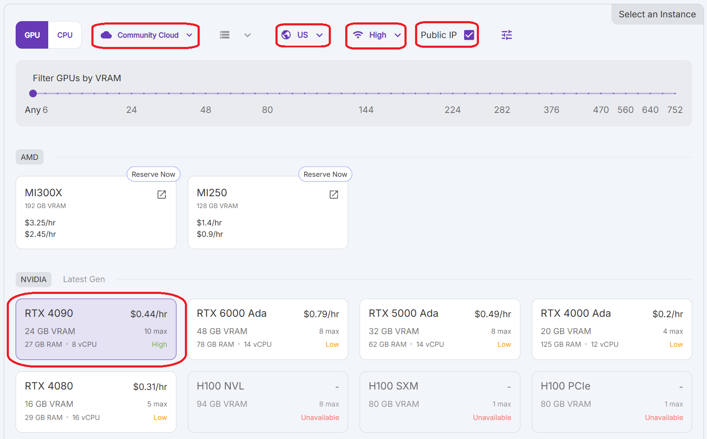
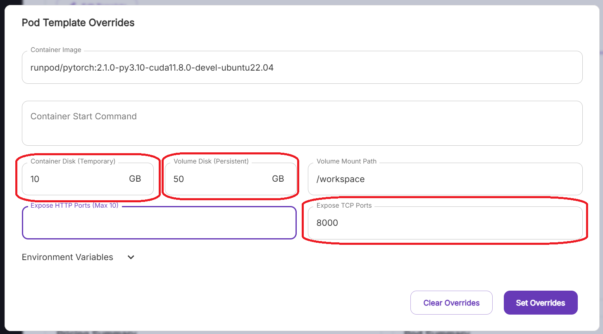
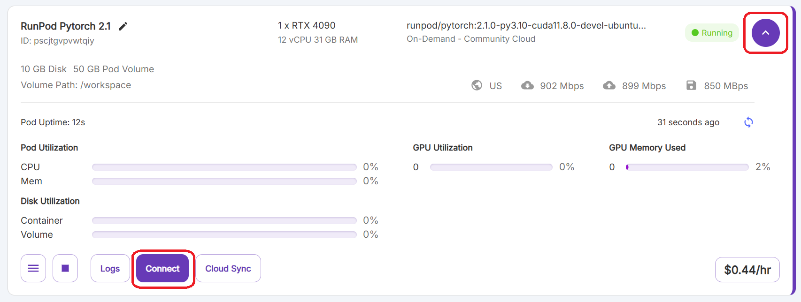
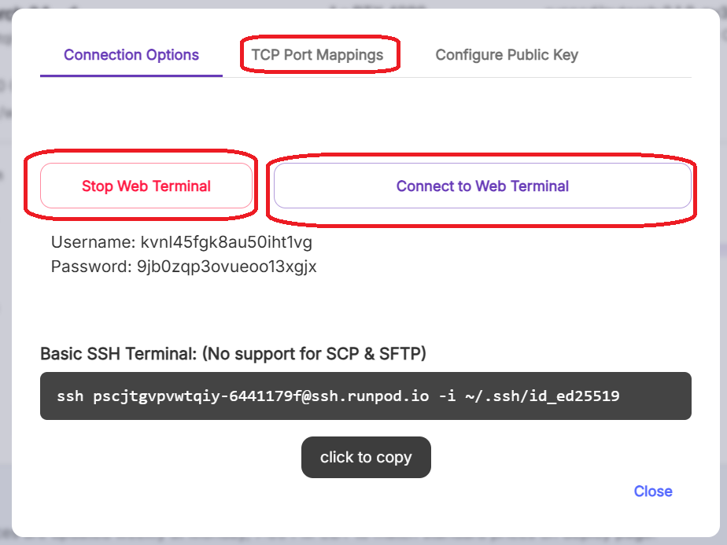
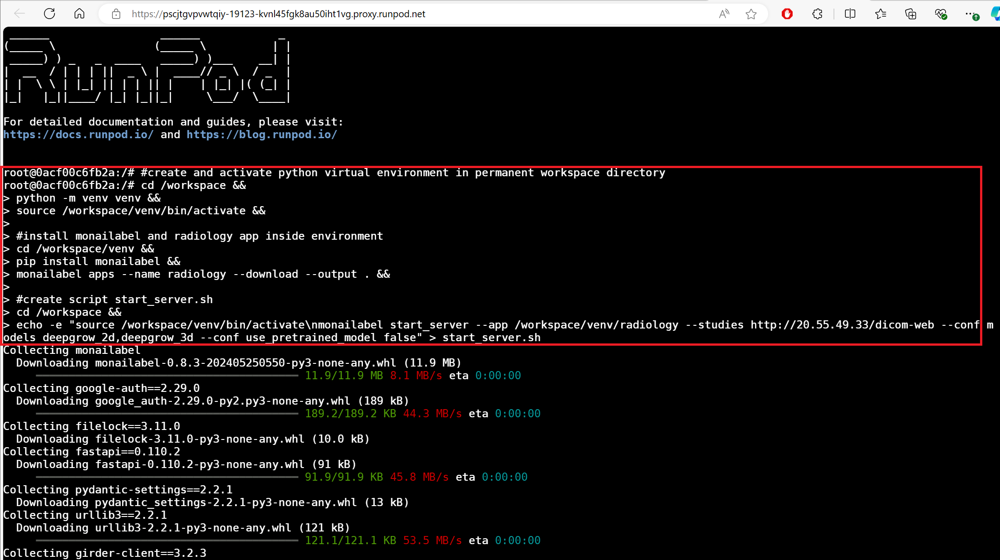
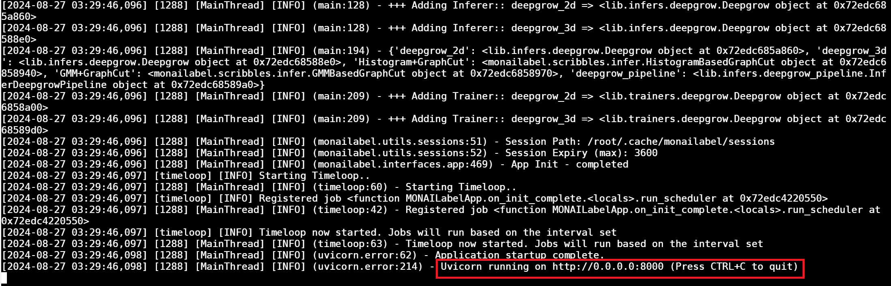
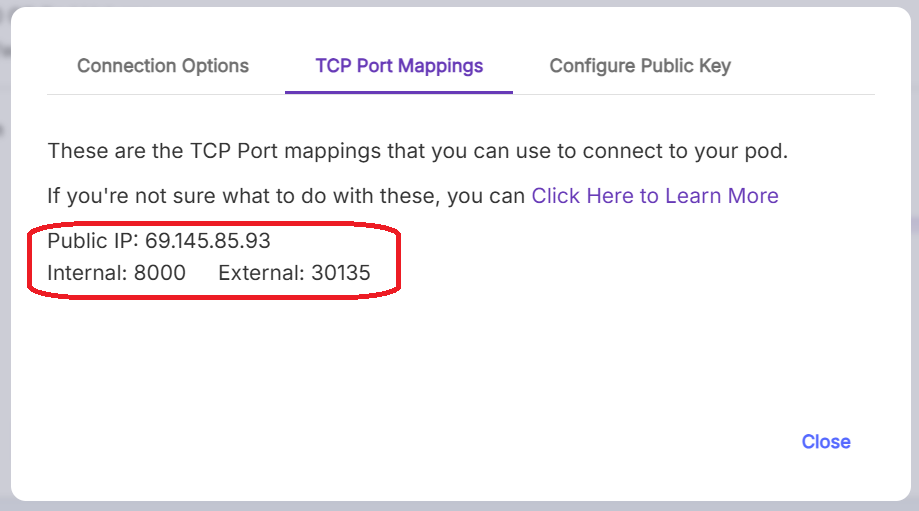
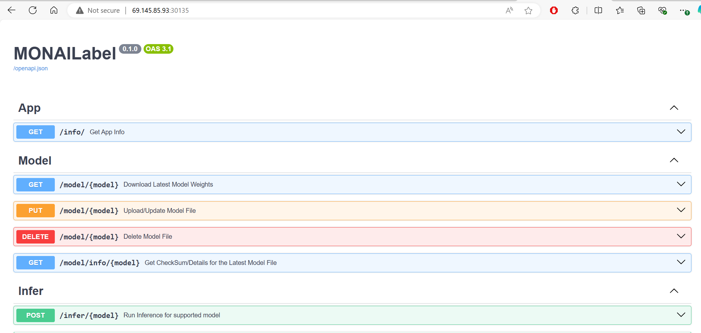

# MONAI Label
## Background and Definitions
MONAI Label is a software tool for using machine learning to automate the image segmentation process. It is run on a server and the user interacts with the server using a client. 3D Slicer is a client that is run on the user's local machine. OHIF is an alternate client that is run on the MONAI Label server and accessed through the user's browser. RunPod is a service that allows you to build a temporary server called a pod with a high end gpu for performing machine learning computations. Orthanc is a software that is used to create a dicom server that stores data for imaging studies. MONAI Label will communicate with an Orthanc dicom server to pull studies and push segmentation files. This tutorial describes how to build a MONAI Label server on a RunPod. 
## Step by step
1. Deploying a RunPod
2. Initializing MONAI Label Server
3. Server Configuration Options
4. Accessing the MONAI Label API
5. Installing MONAI Label Plugin for 3D Slicer
6. Active Learning with MONAI Label
7. Quality Control with MONAI Label Reviewer
## 1. Deploying a RunPod
1. Create a RunPod account: Sign up and log in to [RunPod](https://www.runpod.io/). You will need to request access to the UT Academic AI Team account and will receive a url to link this to your account.
2. Click **Pods** in the toolbar and then **+ Deploy**. Next you will configure the pod. Select the cloud type **Secure Cloud** and change to **Community Cloud**. Then select the location **Any** and change to **US - United States**. Then change the internet speed from **Med** to **High** or **Extreme**. Checl the box for **Public IP**. Finally you will select a GPU. It should have at least 12GB VRAM. The **RTX 4090** is a good option. Remember to stop the machine when not in use because the account will be charged by the hour.

3. When you scroll down, you will see a button **Edit Template**. A recommended starting point is 10GB for the **Container Disk** and 50GB for the **Volume Disk**. You can increase the volume disk later but once increased it cannot be decreased without restarting from scratch. The container disk is temporary disk space that is deleted any time the pod is stopped and restarted. The volume disk is permanent and stored in the /workspace directory. 
4. While on the **Edit Template** section, you want to expose port 8000 so that the pod can communicate with your computer. You can do this under **Expose TCP Ports** by replacing the text with 8000. You can delete the text under **Expose HTTP Ports** or leave the port 8888 exposed.

5. Click **Deploy On-Demand** to start the pod.
6. Under your RunPod, click the down arrow to expand. Click the **Connect** button. Then click the **Start Web Terminal** button and **Connect to Web Terminal**. Alternatively the SSH link provided by runpod can be used to access RunPod through a terminal on a users local computer. This will require you to generate an SSH key and upload through the RunPod Settings. 


## 2. Initializing MONAI Label Server
1. The following text text can be copied and run in the RunPod terminal. This will create a virtual environment and install MONAI Label along with its radiology application in the /workspace directory. After running this text once, the RunPod can be stopped and started without needing to complete this step again. It will also create a script named start_server.sh containing all the commands to run the MONAI Label server upon starting the RunPod. 
```
#create and activate python virtual environment in permanent workspace directory
cd /workspace &&
python -m venv venv &&
source /workspace/venv/bin/activate &&

#install monailabel and radiology app inside environment
cd /workspace/venv &&
pip install monailabel &&
monailabel apps --name radiology --download --output . &&

#create script start_server.sh
cd /workspace &&
echo -e "source /workspace/venv/bin/activate\nmonailabel start_server --app /workspace/venv/radiology --studies http://20.55.49.33/dicom-web --conf models deepgrow_2d,deepgrow_3d --conf use_pretrained_model false" > start_server.sh
```

2. Use the following code to run the script start_server.sh.
```
bash /workspace/start_server.sh
```
3. When the server is up an running you should see this at the end of the page.

## 3. Server Configuration Options
Here is the code used in the start_server.sh script to run the MONAI Label server.
```
monailabel start_server --app /workspace/venv/radiology --studies http://20.55.49.33/dicom-web --conf models deepgrow_2d,deepgrow_3d --conf use_pretrained_model false
```
Notice that after the start_server command there are multiple configuration variables including **--app**, **--studies**, and **--conf models**. These values can be modified to change how the server functions. **--app** defines what MONAI Label application will be used. This tutorial uses the radiology application, but MONAI Label has additional models available in the pathology and MONAI Bundle applications. **--studies** defines the location of the imaging data. The included url points to a DICOM server but you can also point to a directory on RunPod local to the MONAI Label server. **--conf** lets you specify what models to upload or specific model parameters. The following tables list the key parameters used when starting the server and their arguments as well as the models available for use in the radiology application. [This](https://github.com/Project-MONAI/MONAILabel/tree/main/sample-apps/radiology) is a good resource for viewing the available settings for each model.
| Config | Value | Description |
|--------|-------|-------------|
| --app | path/to/radiology | location of radiology app directory on server |
| --studies | path/to/studies | location of studies on server or url for DICOM server |
| --conf models | model_name1,model_name2 | imports listed models separated by commas |

| Models | Description |
|-------|-------------|
| deepedit | imports DeepEdit interactive/automated model |
| deepgrow_2d,deepgrow_3d | imports DeepGrow interacive segmentation model |
| segmentation | imports segmentatino automated model |
| segmentation_spleen | imports model for spleen segmentation |
| localization_spine,localization_vertebra,segmentation_vertebra | imports vertebral segmentation model |
## 4. Accessing the MONAI Label API
Before you can connect to the MONAI Label server using your client (3D Slicer or OHIF), you need to know the url for the API. In step 6 of the RunPod setup, you click the **Connect** button to open up the following window. If you click the **TCP Port Mappings** button this will give you the url. You will use **http://** + **Public IP** + **: (colon)** + **External (port)**. The below example would use **http://69.145.85.93:30135**. This url will not be active until you run the code to start the MONAI Label server. Then your RunPod will connect to its internal port 8000 and send data to the url at http://69.145.85.93:30135. If you paste this url into your browser after starting the server, you will see the MONAI Label API page. 


## 5. Installing MONAI Label Plugin for 3D Slicer
1. Install and run [3D Slicer](https://download.slicer.org/).
2. Install the MONAI Label plugin for 3D Slicer. [This tutorial](https://www.youtube.com/watch?v=KjwuFx0pTXU&list=PLtoSVSQ2XzyD4lc-lAacFBzOdv5Ou-9IA&index=2) shows how to complete the installation and provides an overview of the MONAI Label plugin.
3. Navigate to the MONAI Label plugin and paste the API url from step 4 into the box titled **MONAI Label Server**. Click the refresh button. This should load the model specified by your start_server command.
4. To load a study from the DICOM server, hit the **Next Sample** button. Alternatively, you can load samples to your MONAI Label server directly through the DICOM module in 3D Slicer.
## 6. Active Learning with MONAI Label
This guide will use active learning to fine-tune the [DeepEdit model](https://arxiv.org/pdf/2305.10655). 
1. You want to begin by using the Segment Editor tab to define labels for each segment you want to create. 
2. Now you either use a pretrained model (like the lung_nodule_ct_detection model) to auto segment the study or you manually create a segmentation mask. Here we will start by manually creating a mask and use the DeepEdit model to refinethe mask. This can be done using a paintbrush or basic tools built in to 3D Slicer; however MONAI Label provides the scribbles machine learning algorithm to speed this up. [This tutorial](https://www.youtube.com/watch?v=Wxmo7MVc7hI&list=PLtoSVSQ2XzyD4lc-lAacFBzOdv5Ou-9IA&index=4) shows how to use scribbles algorithm. First you select the region of interest in each anatomic plane. Then you draw lines or "scribble" on the object of interest (foreground) and around the object (background). At any point you can use the **Show 3D** button to see a volumetric rendering of the annotation but this feature should be used sparingly as it slows down 3D Slicer. You can continue adding scribbles and hitting the **Update** button to improve segmentation. After you finish annotating a study, hit the **Submit Label** button to submit the segmentation to the server.
3. After submitting your first annotation, you can begin fine tuning a model to automate segmentation of the rest of your data. [This tutorial](https://www.youtube.com/watch?v=3HTh2dqZqew&list=PLtoSVSQ2XzyD4lc-lAacFBzOdv5Ou-9IA&index=3) shows how to use Active Learning to train a new model. First select the _DeepEdit_ model in the **Active Learning** tab. Hit the **Train** button. Then you can continue annotation of additional studies while the DeepEdit model is being fine-tuned. As you submit labels, the model will improve and the accuracy bar in the Active Learning section will increase. If you change the **Strategy** dropdown from _Random_ or _First_ to _Epistemic_, MONAI Label will change the order so that studies the model has the hardest time with (models with most uncertainty) will be annotated sooner, speeding up the improvement in model accuracy.
4. As the model accuracy improves, you can run the fine-tuned DeepEdit model under the **Auto Segmentation** tab to automatically create a mask on a new study using your model 
## 7. Quality Control with MONAI Label Reviewer
[README](https://github.com/Project-MONAI/MONAILabel/blob/364c693d267529770520982b24652fa45cb2f7d1/plugins/slicer/MONAILabelReviewer/README.md)
